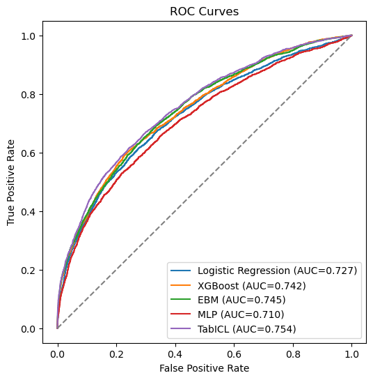
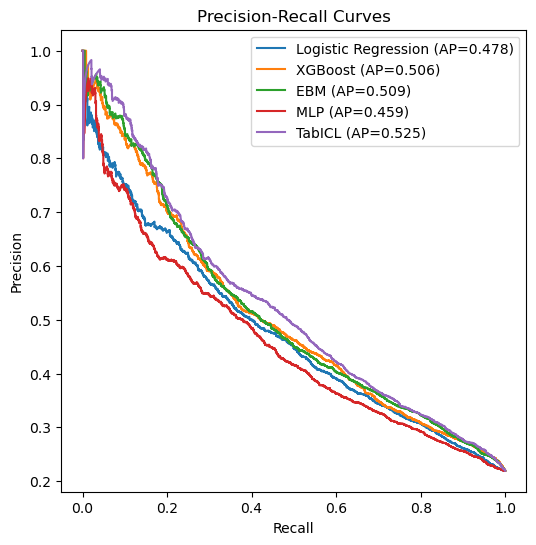
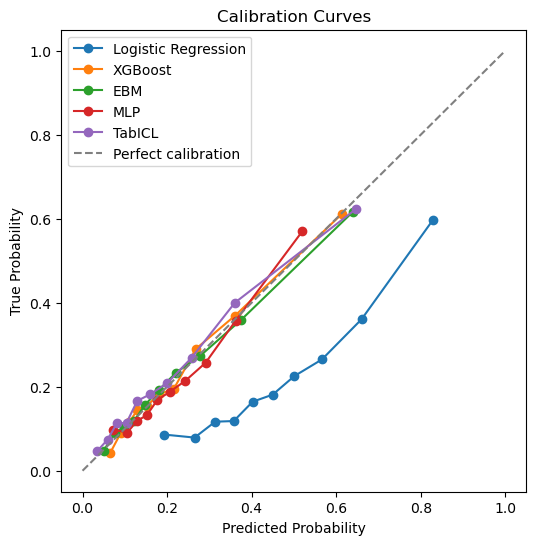

# AI in Healthcare Final Project  
## Mortality Prediction in ICU Pneumonia Patients

This project investigates the performance of different machine learning approaches for predicting in-hospital mortality among ICU patients diagnosed with pneumonia, using structured clinical data from the first 24 hours of ICU admission.

We compare classical statistical models, tree-based methods, interpretable additive models, deep learning, and foundation-style tabular models under a unified experimental pipeline.

## Problem Setup

- **Task**: Binary classification (mortality prediction)
- **Unit of analysis**: ICU stay
- **Features**: Aggregated first-day clinical variables (vitals, labs, blood gas, SOFA)
- **Target**: In-hospital mortality

## Models Evaluated

- Logistic Regression (baseline clinical model)
- XGBoost (tree-based ensemble)
- Explainable Boosting Machine (EBM / GA2M)
- Multilayer Perceptron (MLP)
- TabICL (foundation-style tabular model)

## Methodology

- **5-fold stratified cross-validation**
- **Hyperparameter tuning via GridSearchCV (within training folds)**
- **Evaluation metrics**:
  - AUROC
  - AUPRC
  - Brier Score (calibration)

- **Model-specific preprocessing**:
  - Logistic Regression / MLP → imputation + scaling
  - XGBoost → native missing value handling
  - EBM → missing values as separate bins
  - TabICL → raw features (no preprocessing)

## 📁 Repository Structure
```
.
├── src/
│ ├── config.py # Global configuration (random seeds, constants)
│ ├── cv_runner.py # Cross-validation pipeline (run_cv_model)
│ ├── data_utils.py # Data loading and preprocessing utilities
│ ├── metrics_utils.py # Evaluation metrics (AUROC, AUPRC, Brier)
│ ├── results_utils.py # Plotting (ROC, PR, calibration curves)
│ ├── models_classical.py # Logistic Regression, XGBoost
│ ├── models_deep.py # MLP and TabICL
│ └── .DS_Store # System file (can be ignored)
│
├── .gitignore
├── requirements.txt
```

## 🚀 How to Run

### 1. Install dependencies

```bash
pip install -r requirements.txt
```

### 2. Run experiments

Use the main pipeline function:
```
from src.cv_runner import run_cv_model
from src.models_classical import fit_predict_logistic, fit_predict_xgboost
```
Each model follows the same interface: 
```
metrics_df, preds_df = run_cv_model(
    X=X,
    y=y,
    ids=ids,
    model_name="XGBoost",
    fit_predict_fn=fit_predict_xgboost
)
```
### 3. Outputs

The pipeline generates:
* Fold-level metrics
* Predicted probabilities
* Aggregated summary metrics

### 4. Key Findings
* TabICL achieves the best overall performance across AUROC and AUPRC
* XGBoost and EBM perform competitively, with strong calibration
* Logistic Regression remains a strong baseline, but underperforms on nonlinear patterns
* MLP does not outperform classical tabular models, consistent with prior literature

## 📊 Model Evaluation Results

### Performance Summary

| Model | AUROC | AUPRC | Brier Score |
|-------|-------|-------|-------------|
| EBM | 0.7448 ± 0.0058 | 0.5099 ± 0.0185 | 0.1431 ± 0.0025 |
| Logistic Regression | 0.7274 ± 0.0105 | 0.4799 ± 0.0161 | 0.2054 ± 0.004 |
| XGBoost | 0.7418 ± 0.008 | 0.5063 ± 0.0133 | 0.1436 ± 0.0018 |
| MLP | 0.7105 ± 0.0103 | 0.4614 ± 0.0145 | 0.1507 ± 0.0018 |
| **TabICL** ⭐ | **0.7546 ± 0.0087** | **0.5267 ± 0.0223** | **0.1411 ± 0.0033** |

> ⭐ TabICL achieves the best performance across all three metrics.

---

### ROC Curves



*TabICL leads with AUC = 0.754, followed closely by EBM (0.745) and XGBoost (0.742).*

---

### Precision-Recall Curves



*TabICL achieves the highest average precision (AP = 0.525), outperforming all tree-based
and neural baselines — particularly relevant given class imbalance in the dataset.*

---

### Calibration Curves



* *TabICL, EBM, and XGBoost track the perfect calibration diagonal closely in the low-to-mid probability range.*
* *Logistic Regression diverges from the calibration diagonal above a predicted probability of ~0.4, a pattern consistent with score compression in linearly-separable-assumption models when the true decision boundary is non-linear — resulting in systematic underestimation of high-risk instances.*

### 5. Data Availability
* Due to data governance constraints of the MIMIC-IV database, raw data cannot be shared in this repository.
* The cohort is constructed using SQL queries, and all experiments are conducted on first-day ICU features to ensure reproducibility and prevent data leakage.
